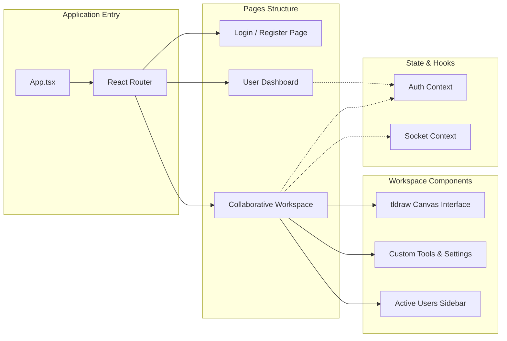

# Collaborative Board - Frontend

This repository contains the interactive React + TypeScript frontend for the Collaborative Board application. It provides a real-time drawing experience using tldraw, secure user authentication, and a dashboard for managing collaborative rooms.

## 🚀 Tech Stack

- **React 19 & TypeScript**: Component-based UI with strong type safety.
- **Vite**: Lightning-fast build tool and development server.
- **tldraw**: High-performance, rich whiteboard library.
- **Socket.io-client**: Real-time communication with the backend.
- **Tailwind CSS v4**: Utility-first styling for a sleek, modern UI.
- **Axios & React Router**: API requests and client-side routing.

## 🎨 UI/UX Features
- **Responsive Layout**: Designed to work flawlessly on both desktop and mobile screens.
- **Infinite Canvas**: Allows you to zoom and pan infinitely to flesh out massive ideas.
- **Live Cursors & Presence**: See what others are working on in real-time.
- **Tailwind v4 Styling**: Leveraging the latest Tailwind advancements for a seamless, aesthetic design.

## 📐 Application Architecture

The following graph outlines the structural hierarchy of the React frontend:


## 📁 Key Directories
- `src/api/`: Axios instances and functions for auth and board REST endpoints
- `src/components/`: Reusable UI components like Login, TldrawBoard, and AnimatedTrailCanvas.
- `src/pages/`: Main application views including the Dashboard and BoardRoom.
- `src/types/`: TypeScript interfaces and type definitions for API responses and application state.
- `src/assets/`: Static assets such as icons and SVGs.

## 🔌 WebSocket Events (Socket.io)
| Event | Type | Description |
| :--- | :--- | :--- |
| `join-room ` | Emit | Sends userName and roomId to join a specific session.|
| `draw-action` | Listen/Emit | Synchronizes freehand drawing and legacy canvas actions.|
| `cursor-move` | Listen/Emit | Broadcasts mouse coordinates to show active participant cursors.|
| `tldraw-changes` | Listen/Emit | Syncs granular updates to shapes and states within the tldraw infinite canvas.|
| `user_list` | Listen | Receives the current list of online users to update the UI.|
| `permission-changed` | Listen | Notifies a user if their drawing rights have been enabled or disabled by an admin.|

## 📜 Available Scripts

- `npm run dev`: Starts the Vite development server.
-  `npm run build`: Compiles the application into highly optimized static assets for production.
- `npm run lint`: Runs ESLint to find and fix problems in the codebase.
- `npm run preview`: Locally previews the production build.

## 🔒 Security & Performance

- **JWT Storage**: Securely stores authentication tokens in localStorage for persistent sessions.
- **Protected Routes**: Redirects unauthenticated users to the login page when attempting to access the dashboard or rooms.
- **Throttled Events**: Socket events like cursor-move are optimized to ensure smooth performance without overwhelming the network.

> ### 💡 IMPORTANT / NOTES 
> This repository contains the **Frontend App only**.<br>
> The interactive **Node.js + Socket.io backend** can be found here:<br>
> 👉 [BACKEND](https://github.com/soham-kolhe/collaborative-board-backend)
>
> 📗 [ROOT DOCS](https://github.com/soham-kolhe/collaborative-board/blob/main/README.md)

## ⚙️ Setup & Installation

### Prerequisites
- Node.js (v18 or higher)
- A running instance of the Collaborative Board Backend
<hr>

1. **Clone the repository:**
   ```bash
   git clone <your-repo-url>
   cd collaborative-board-frontend
   ```

2. **Install dependencies:**
   ```bash
   npm install
   ```

3. **Environment Variables:**
   Create a `.env` file in the root directory:
   ```env
   VITE_BACKEND_URL=http://localhost:5000
   ```

4. **Start the development server:**
   ```bash
   npm run dev
   ```
   The application will be accessible at `http://localhost:5173`.

5. **Build for production:**
   ```bash
   npm run build
   ```

## 💻 Created By
Soham Kolhe
